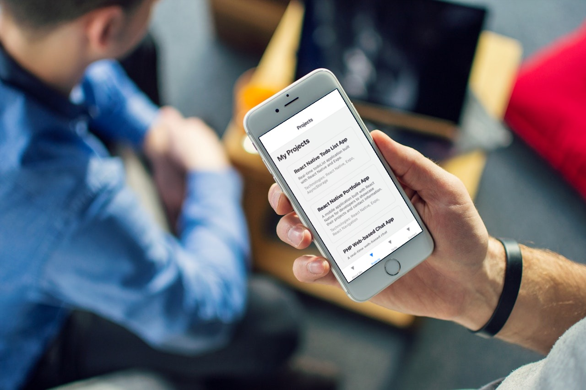
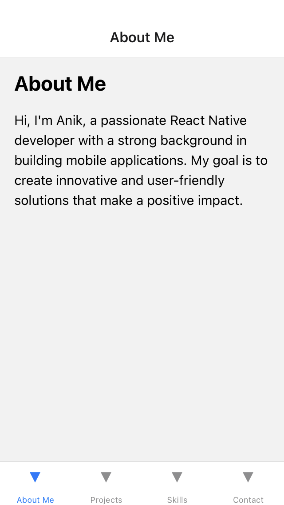
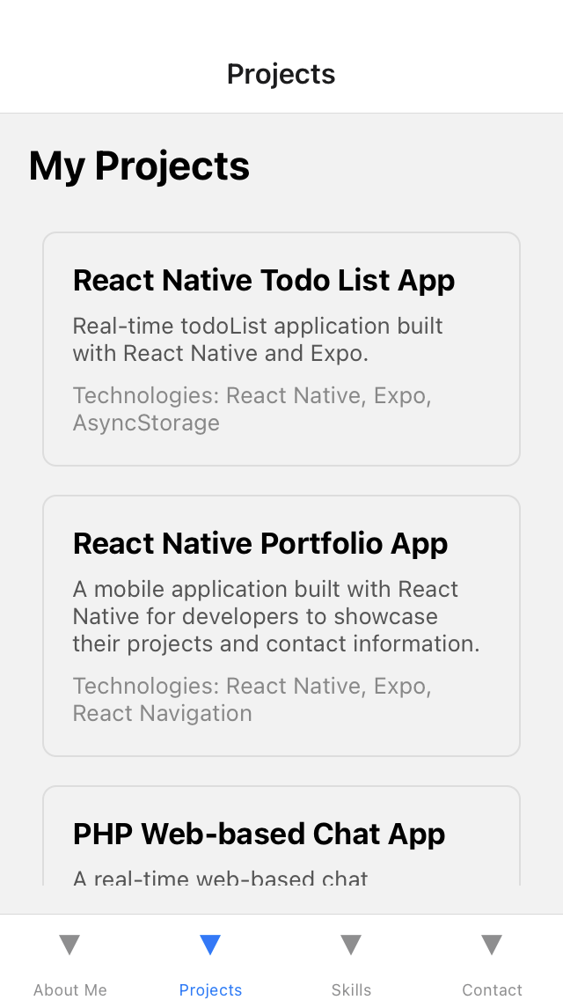
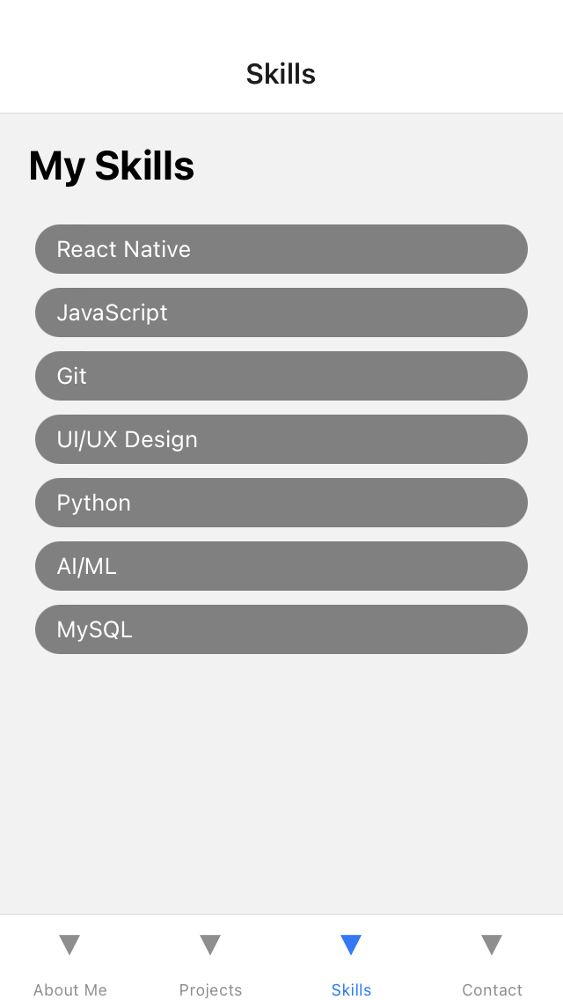
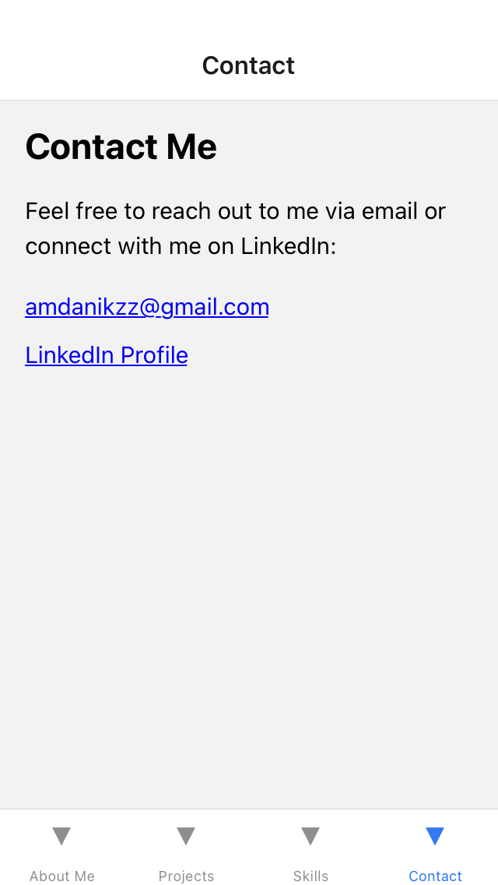

# Portfol.io


## Overview

Portfol.io is a React Native portfolio app tailored for app developers, enabling them to showcase projects and contact details in a mobile-friendly format. With dedicated screens for project listings, skill showcases, and contact information, it offers a comprehensive platform for professionals to exhibit their work and expertise.

## Features

- **Home Screen:** Display a list of projects with brief descriptions.
- **Project Detail Screen:** Show detailed information about a selected project.
- **Skills Screen:** Showcase skills of the app developer.
- **Contact Screen:** Provide contact information for the app developer.
- **Navigation:** Use React Navigation for seamless navigation between screens.

## Installation

1. Clone the repository:

    ```bash
    git clone https://github.com/duskdev17/portfolioApp.git
    cd portfolioApp
    ```

2. Install dependencies:

    ```bash
    npx install
    ```

3. Run the app:

    ```bash
    npx expo start
    ```


## Tech Stack

- React Native
- React Navigation
- Expo

## Screenshots

<div style="display: flex; justify-content: space-between;">
  
  
  
  
</div>
<!-- Add more screenshots as needed -->

## Usage

- View the list of projects on the home screen.
- Tap on a project to view its details.
- Access the contact screen to get in touch with the app developer.

## Contributing

Contributions are welcome! If you find any issues or have suggestions for improvements, please open an issue or submit a pull request.

## Future Enhancements

- **Responsive Design:** Ensure that the app is fully responsive and optimized for various screen sizes and devices, including mobile phones, tablets, and desktops.
- **Portfolio Customization:** Allow developers to customize the appearance of their portfolio by choosing different themes, layouts, and color schemes.
- **Customizable Themes:** Allow users to customize the app's theme for a personalized touch.
- **Detailed Content:** Implement stack navigator to show more detailed contents.

## License

This project is licensed under the [MIT License](LICENSE).
